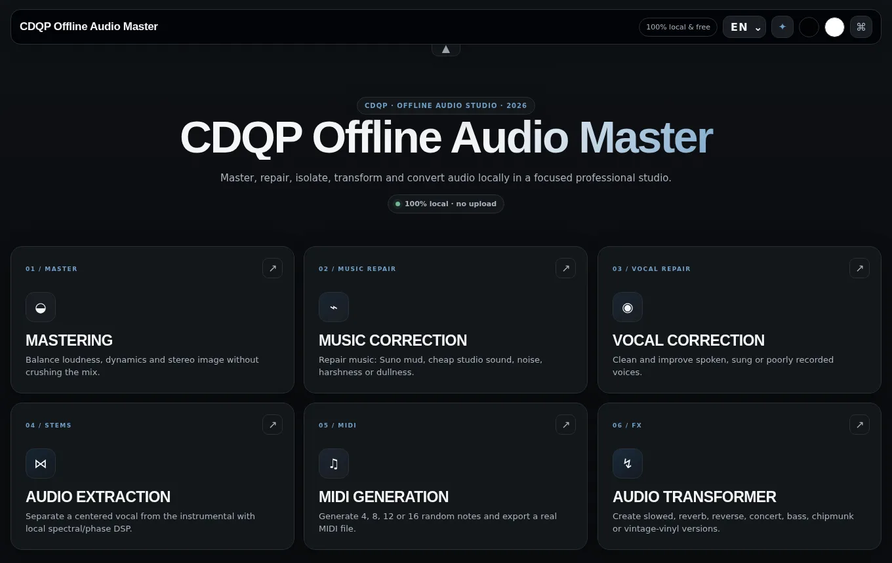
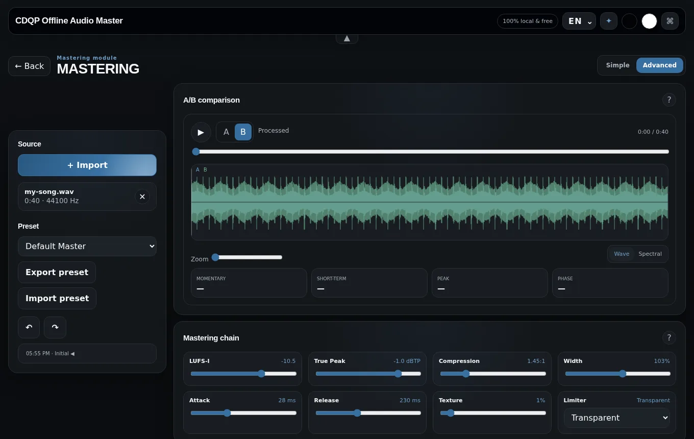

# CDQP Offline Audio Master

[](https://github.com/cdqp/AudioMaster-Offline/actions/workflows/tests.yml)

**A free audio studio that runs 100 % in your browser, from a single HTML file.**
Master a track, repair a music or vocal recording, split vocals from the instrumental, generate MIDI and create
alternate versions — without uploading anything, without an account, and even without an internet connection.

> 🇫🇷 **En bref** — Un studio audio gratuit, 100 % local, contenu dans un seul fichier HTML : mastering par genre,
> réparation de musique (dont Suno) et de voix, séparation voix / instrumental, génération MIDI et effets.
> Vos fichiers ne quittent jamais votre appareil. Téléchargez `CDQP.Offline.Audio.Master.html`, ouvrez-le dans
> votre navigateur, déposez un fichier : c'est tout. L'interface est disponible en 35 langues, dont le français.



## Modules

| Module | What it does |
| --- | --- |
| **01 · Mastering** | Genre presets (Default, Pop, Hip-Hop/Rap, Rock, EDM, Electronic) that bring a mix to a loudness target with gentle compression, saturation, stereo width and a look-ahead true-peak limiter. |
| **02 · Music repair** | Fixes complete songs: Suno / AI-generated mud and progressive dullness, cheap-studio sound, background noise, muddy, harsh or dull mixes. |
| **03 · Vocal repair** | Cleans spoken, sung, phone, noisy or isolated vocals (denoise, de-click, de-ess, de-reverb, presence). |
| **04 · Stems** | Local vocal / instrumental separation (spectral, phase and harmonic masking, with a high-quality multi-pass mode). The two stems always sum back to the original. |
| **05 · MIDI** | Generates 4–16-note melodies (scale, octave, tempo, rhythm, randomness, two variations to compare) and exports a standard `.mid` file. *Music to MIDI* turns a song into a monophonic retro 8-bit melody. |
| **06 · FX** | Reverb, slowed, slowed + reverb, speed up, slow down, reverse, live concert, bass boost, chipmunk and old vinyl versions. |

Every module has a **Simple** mode (pick a task, press *Process*, compare A/B, export) and an **Advanced** mode with
every parameter, a live A/B preview, undo/redo history and preset import/export (JSON).



## Privacy

There is no server. Decoding, analysis, processing and encoding all happen in your browser with the Web Audio API
and a Web Worker; the page makes no network request. Settings (language, theme, animations) are kept in
`localStorage` on your device.

## Getting started

1. Download [`CDQP.Offline.Audio.Master.html`](CDQP.Offline.Audio.Master.html) (or clone the repository).
2. Open it in a recent Chrome, Edge, Firefox or Safari.
3. Drop an audio or video file (WAV, MP3, M4A/AAC, FLAC, OGG/Opus, MP4, WebM — whatever your browser can decode),
   choose a module and a task, then *Process* and *Export*.

To publish it online, enable **GitHub Pages** on the repository (branch `main`, folder `/`): `index.html` forwards
visitors to the app.

### Install it as an app

When the app is opened from a web address (GitHub Pages or any HTTPS server), it can be installed like a native
application (an *Install app* button appears in the header, or use the browser's install menu). After the first
visit it keeps working offline; new versions are picked up automatically on the next visit.

### Keyboard shortcuts

| Keys | Action |
| --- | --- |
| `Space` | Play / pause |
| `A` / `B` | Original / processed (MIDI: variation A / B) |
| `Ctrl`/`⌘` + `Z` | Undo |
| `Ctrl`/`⌘` + `Y` or `Ctrl`/`⌘` + `Shift` + `Z` | Redo |
| `Esc` | Close the help dialog, the language menu or the shortcut panel |
| hold `Ctrl`/`⌘` | Show the shortcut panel |

## How it works

**Mastering and repair** (offline render)

1. Stereo down-mix (mono, stereo, 3.0, 4.0, 5.0 and 5.1 sources), peak headroom and DC removal.
2. Restoration, depending on the task: de-click, spectral denoise (STFT; the noise profile starts from the quietest
   10 % of the track and keeps adapting), de-reverb, and the *Suno temporal repair* that progressively corrects mud
   and missing air when the end of a song is duller than its start.
3. Tone chain, built once and shared by the render and the live A/B preview: high-pass (12 or 24 dB/oct
   Butterworth), low-pass, 10-band EQ, mud / presence / air, de-esser, low-band control (Linkwitz-Riley 250 Hz
   crossover with a compressor on the lows), bus and glue compression, 4× oversampled saturation and mid/side width.
   Web Audio specifics are compensated: compressor and oversampler latency (output stays sample-aligned with the
   source), compressor make-up gain on the split band, and the dB-based `Q` of Web Audio high/low-pass filters.
4. Loudness: gain towards the LUFS target, look-ahead limiter (transparent 14 ms, brickwall 8 ms, or soft with a
   saturating knee), iterated until the integrated loudness lands on target. To protect dynamics the limiter never
   takes more than 6 dB off the loudest peak; the status line says when that cap prevented reaching the target.
   A final true-peak check (4× / 8× interpolation) guarantees the dBTP ceiling.
5. Export as WAV 24-bit, 32-bit float, or 16-bit with TPDF dither.

**Measurements** — integrated loudness per ITU-R BS.1770-4 (K-weighting reproducing the reference coefficients,
absolute and relative gating), loudness range per EBU Tech 3342, true peak, crest factor and stereo correlation.
The live meters of the preview are lightweight approximations.

**Stem separation** — runs in a Web Worker on an STFT (2048 to 8192 points). Each bin receives a vocal mask from
left/right coherence, mid/side balance, harmonic peaks, spectral flux and the vocal band, then the mask is smoothed
across frequency and time. *Vocal clarity* sets how strictly ambiguous content is given to the vocal. The
high-quality mode runs three variants and keeps a median consensus. It is signal processing, not a neural network:
it works best when the lead vocal is centred.

**MIDI** — Standard MIDI File (format 0, 480 PPQ) whose timing matches the preview for every rhythm. *Music to MIDI*
tracks the dominant pitch with autocorrelation and quantises it to the chosen scale and range.

## Development

The whole app lives in `CDQP.Offline.Audio.Master.html` (styles, markup, translations, presets, DSP and the Web
Worker source), so it can be shared as one file. The repository adds the installable-app files (`manifest.webmanifest`,
`sw.js`, `icons/`), the documentation and a headless test-suite.

```bash
npm install
npx playwright install chromium   # once
npm run lint                      # scripts compile, ids unique, element lookups resolve
npm test                          # DSP + UI tests in headless Chromium
npm test -- limiter               # only the tests whose name contains "limiter"
```

The tests check the loudness meter against the EBU Tech 3341 / 3342 reference signals, true-peak detection, the
limiter (ceiling and smooth gain), alignment and flatness of the tone graph, filter slopes, loudness targeting,
stem reconstruction, denoising, WAV and MIDI encoders, multichannel down-mix, the main UI flows (disabled
states, help dialogs, cancellation, every effect), accessibility (axe-core) and the offline hosted version. They
run on every push through GitHub Actions.

## Limitations

- Long files are memory-hungry: the app keeps several decoded copies (source, preview, result) in memory.
- Stem separation and *Music to MIDI* are DSP heuristics, not machine-learning models.
- Available input formats depend on the browser's own decoders.

See [CHANGELOG.md](CHANGELOG.md) for the history of changes and [CONTRIBUTING.md](CONTRIBUTING.md) to get involved.

## Credits

GPT-5.6 Sol, CDQP — 2026.

No licence file is included yet, which means the default copyright rules apply (all rights reserved). Add a
`LICENSE` file (for example MIT) if you want others to reuse or modify the code.
